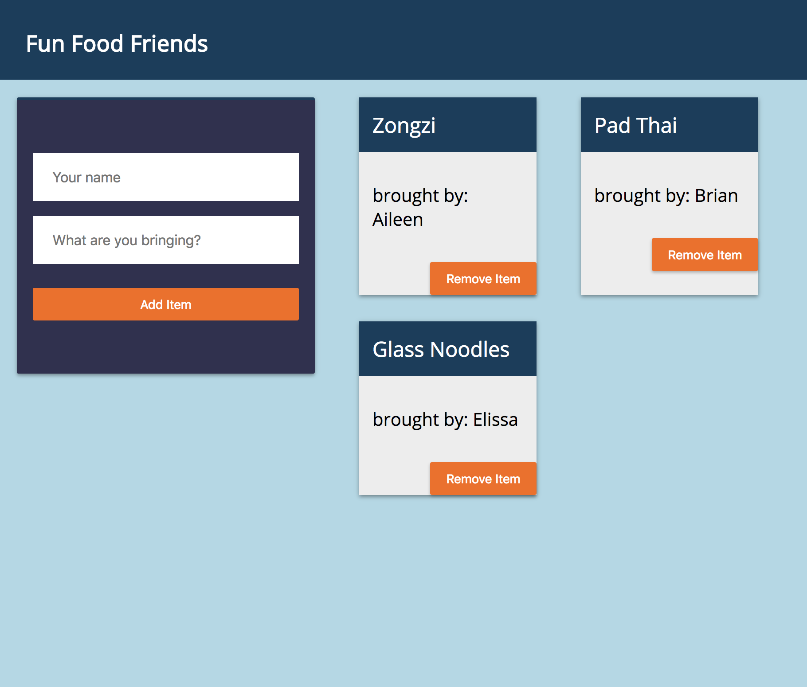
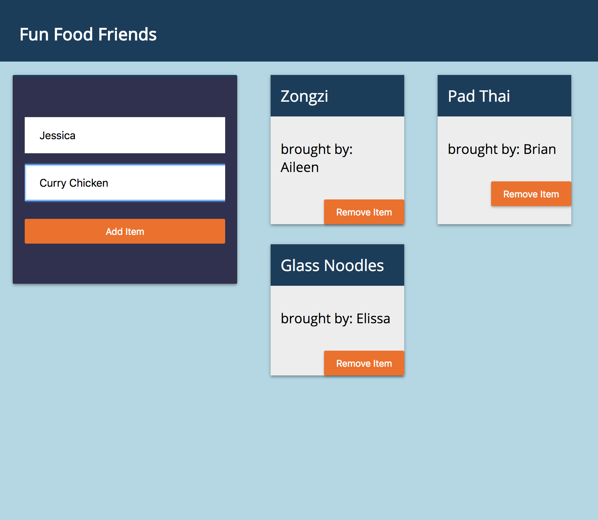
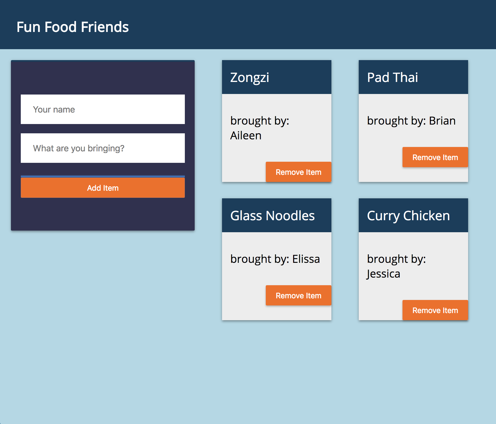
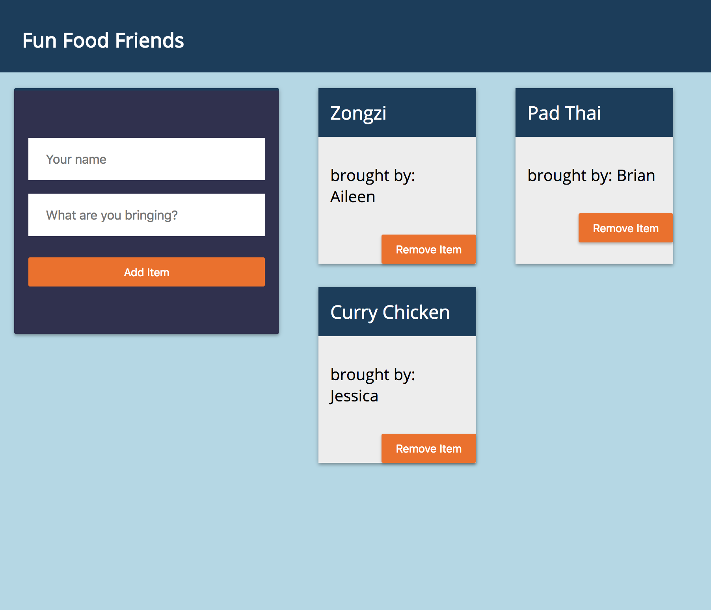

# Food, Fun, Friends!
This application is designed to keep track of attendees and dishes/items brought for a potluck.

## How to use:
Open the application.

Type in your name and the item you're bring to the potluck and click Add Item.

Click Remove Item from the item you wish to remove.

Continue adding or removing items.

## Technologies used:
* [React](https://reactjs.org/)
* [Firebase](https://firebase.google.com/)

## Setup
1. In package.json, change homepage to your project URL.
1. In the command line, run `yarn` to install dependencies.
1. Rename sample.firebase.js to firebase.js and add values from your firebase database.
1. When you are ready to deploy, run `yarn run predeploy` and then, `yarn run deploy`.